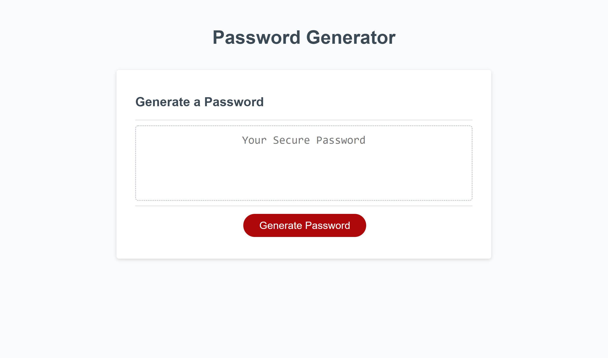
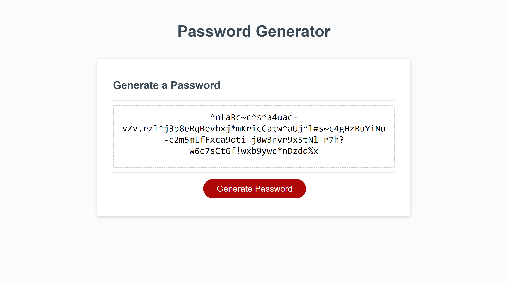

# JavaScript Password Generator

## Table of Contents

* [Description](#description)
* [Links](#links)
* [Screenshots](#screenshots)
* [Installation Instructions](#installation-instructions)
* [Usage](#usage)
* [Technologies Used](#technologies-used)
* [Tests](#tests)
* [Credits](#credits)
* [Contributing](#contributing)
* [Questions](#questions)
* [Badges](#badges)

## Description

This is a random password generator using JavaScript. The user selects the following criteria: 
* length of the password
* which character sets to use
  * lower case
  * upper case
  * numbers
  * and special characters [!, #, %, ^, *, +, -, _, ?, ., and ~]

After selecting the criteria, the user then clicks the button, which prompts ths program to run to generate a random secure password that fits the user's criteria.

## Links

[Password Generator site](https://lauracole1900.github.io/JavascriptPasswordGenerator/)

## Screenshots

Password generator without password:


Password generator with password:


## Installation Instructions

If you want to run a copy of this app on your local machine, first clone the repository:

HTTPS:
```
$ git clone https://github.com/LauraCole1900/JavascriptPasswordGenerator.git
```

SSH:
```
$ git clone git@github.com:LauraCole1900/JavascriptPasswordGenerator.git
```

Then cd into the directory into which you cloned, right-click on index.html, and choose "Open in default browser."

## Usage

This project is intended to be used to generate secure passwords between 8 and 120 characters long.

## Technologies Used

HTML, CSS, JavaScript

## Tests

npm run test

## Credits

Base code and styling developed and provided by 2U/Trilogy Education Services

## Contributing

N/A

## Questions

If you have further questions, you can reach me at lauracole1900@comcast.net. For more of my work, see [my GitHub](https://github.com/LauraCole1900).

## Badges

 [](https://open.vscode.dev/LauraCole1900/JavascriptPasswordGenerator)