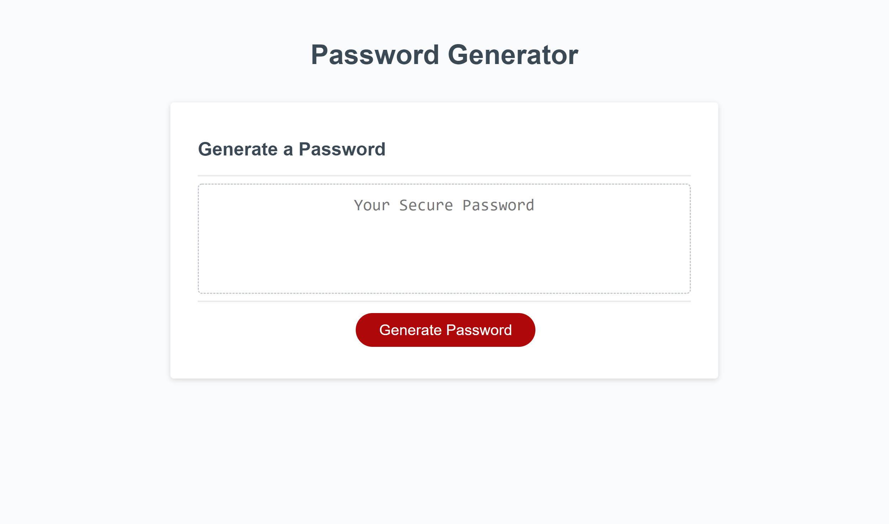
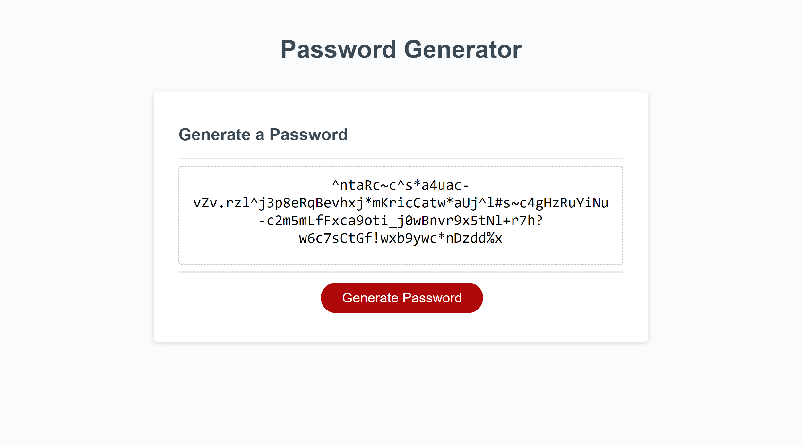

# JavaScript Password Generator

#### Description

This is a random password generator using JavaScript. The user selects the following criteria: 
* length of the password
* which character sets to use
  * lower case
  * upper case
  * numbers
  * and special characters [!, #, %, ^, *, +, -, _, ?, ., and ~]

After selecting the criteria, the user then clicks the button, which prompts ths program to run to generate a random secure password that fits the user's criteria.

#### Screenshots

#### Link
[Password Generator site](https://lauracole1900.github.io/JavascriptPasswordGenerator/)